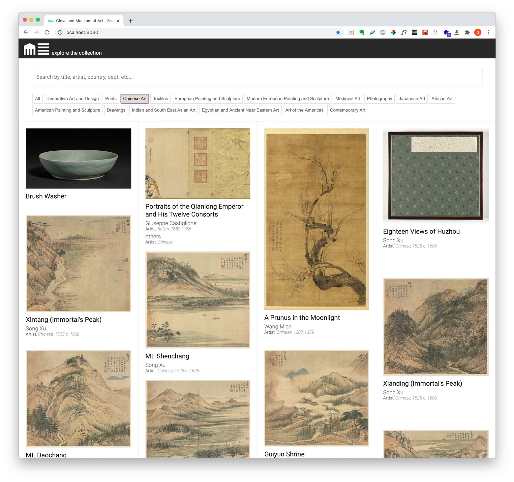

# Museum Collection Interface

Front-end app to search, sort and view details for a selection of items from The Cleveland Museum of Art's Collection

### Installing

- npm install

### Instructions

- npm run dev
- View on localhost:8080

## Author

- Greg Panciera
- All images and database content, property of The Cleveland Museum of Art

## Screenshots

