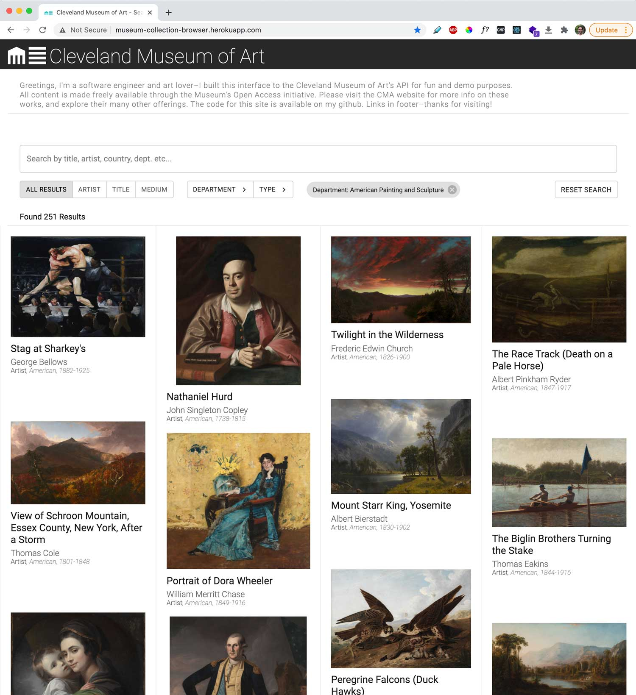

# Museum Collection Interface

App to search and explore details for items from The Cleveland Museum of Art's Collection. Live demo here: http://museum-collection-browser.herokuapp.com/

### Installing

- npm install

### Instructions

- npm run dev
- View on localhost:3000

## Author

- Greg Panciera

## Screenshots

